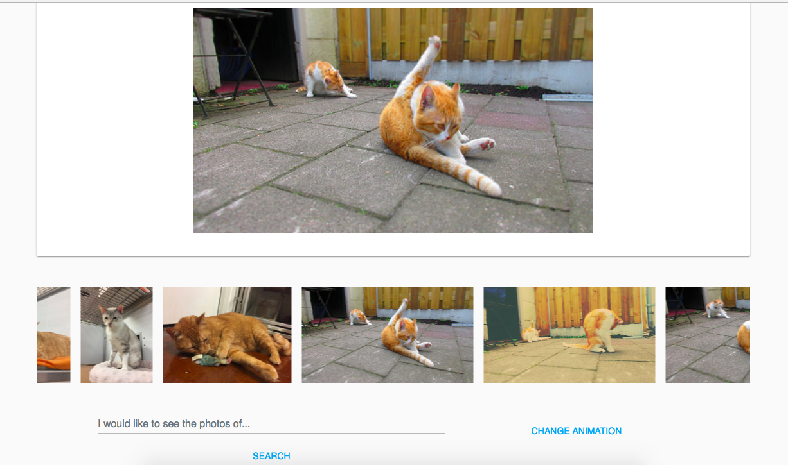

photo-album app has been created using React and Redux and it was bootstrapped with Create React App.

This is a simple photo gallery that utilizes Flickr API as a photo database.

If you click on the photo at the slide bar at the bottom the big photo in the center of the page will change and animate.

There is also the searchbar that appears below the slidebar, so the user can find and fetch another photos to the gallery.
And at the bottom of the page is a button for changing the animation style.

## Demo

[https://golasowska.github.io/photo-album/ ](https://golasowska.github.io/photo-album/)

## Preview



To run the app locally you have to use the following instructions in your console:

```
npm install
npm start
```

Then open [`localhost:3000`](http://localhost:3000) in a browser.
